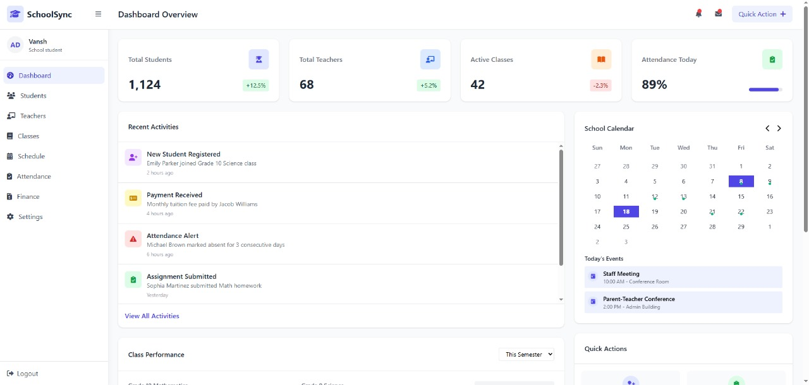

# 🎓 School Management System

Welcome to the **School Management System** — a PHP & MySQL web application designed to streamline school administration such as student management, attendance, exams, library, and more.

---

## 🚀 Features

### 👥 User Roles
- **Admin**: Manage students, teachers, librarians; send notices; view attendance/logs; manage courses and routines.
- **Teacher**: Take attendance; upload notes; assign marks; post notices.
- **Student**: View schedule, notices, attendance, results; upload assignments; request library/books.
- **Librarian**: Manage library books, issue/return logs, fines, and new arrival notices.

### 🎯 Core Capabilities
- User registration, login, profile management, password reset
- CRUD operations for users, books, courses, schedules
- Attendance and leave request system
- Exam result upload and report card download
- Class routines, library services, notifications
- File uploads: notes, assignments, documents

---

## 🛠️ Tech Stack

- **Backend**: PHP (version 7+)
- **Database**: MySQL
- **Frontend**: HTML, CSS, Bootstrap, JavaScript/jQuery

---

## 📦 Setup & Installation

Follow these steps to run the project locally:

1. **Clone the repo**
    ```bash
    git clone https://github.com/Psychokiller70/school_management_system.git
    cd school_management_system
    ```

2. **Install requirements**
    - Ensure you have PHP (7+) and MySQL (or use XAMPP/LAMP/MAMP).

3. **Import the database**
    - Create a DB (e.g., `school_management_system`)
    - Import the provided `.sql` dump (e.g., `school_management_system.sql`) via phpMyAdmin or CLI.

4. **Configure DB connection**
    - Edit database credentials in a config file (e.g., `config.php`):
      ```php
      <?php
      $host = "localhost";
      $user = "root";
      $pass = "";
      $db   = "school_management_system";
      ?>
      ```

5. **Deploy & run**
    - Place the folder in your web root (`htdocs` or `www`)
    - Start Apache and MySQL
    - Access at: [http://localhost/school_management_system](http://localhost/school_management_system)

---

## 📋 Default Login Credentials

Use the following to log into different panels:

| Role      | Email                   | Password     |
|-----------|--------------------------|--------------|
| Admin     | `admin@school.com`       | `admin123`   |
| Teacher   | `teacher@school.com`     | `teacher123` |
| Student   | `student@school.com`     | `student123` |
| Librarian | `librarian@school.com`   | `librarian123` |

> 🔐 New student & teacher passwords are set to their **date of birth** (e.g. `DDMMYYYY`).

---

## 🧑‍💻 Usage

- **Admin**: Full system access — user, course, and schedule management.
- **Teacher**: Manage class content, attendance, and grades.
- **Student**: View courses, upload homework, request leaves/books.
- **Librarian**: Handle book inventory, issuance, and fines.

---

## 📸 Screenshots
 
> '`  
> ``

---

## 🤝 Contributing

Contributions are welcome! Please follow these steps:
1. Fork the repo
2. Create a feature branch (`git checkout -b feature-XYZ`)
3. Commit changes (`git commit -m "Add new feature"`)
4. Push (`git push origin feature-XYZ`)
5. Submit a Pull Request

---

## 📄 License

This project is licensed under the **MIT License** – see the [LICENSE](LICENSE) file for details.

---

## 👨‍💻 Author

Developed with ❤️ by **Psychokiller70**  
Contact me: vanshkumar707878@gmail.com

---

## 🧭 Roadmap

- ✅ Initial PHP & MySQL implementation
- 📤 Implement role-based access control
- ❗ Upcoming: Live notifications, SMS/email alerts, responsive UI

---

Thanks for visiting! Enjoy managing your school digitaly 🎉
